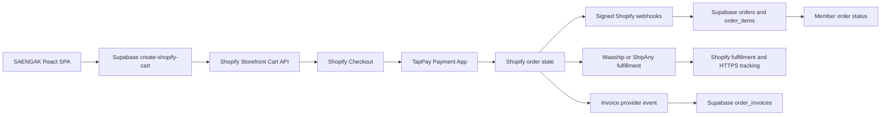

# SAENGAK 後續開發與正式上線交接文件

> 盤點日期：2026-08-13（Asia/Taipei）
> 專案路徑：`/Users/charlieliu/Documents/GitHub/saengak_web`
> 正式網域：`https://saengak.com.tw`
> 目前判定：**展示與測試底盤可用，但尚未達到正式收款上線條件**

## 1. 文件目的

本文件供後續工程師、營運、金流、物流與法務協作者快速接手 SAENGAK 網站，說明：

- 哪些功能已經存在並通過檢查。
- 哪些結果只是展示、靜態檢查或歷史驗證，不可誤稱為正式交易證明。
- 正式上線前的 P0／P1 待辦、權威資料來源及驗收標準。
- 安全部署順序、測試指令、回滾與交接注意事項。

本文件不保存密碼、API Token、Webhook Secret、客戶／訂單資料、卡號、驗證碼或其他敏感資訊。

## 2. 接手者先讀摘要

### 2.1 可以確認的現況

- `https://saengak.com.tw` 可正常連線，HTTPS、SPA shell、安全標頭與七個未授權 Edge Function 探針通過 `23/23`。
- 公開未登入訪客目前只會看到 `Coming Soon`；這是既有上線閘門，不是正式品牌站已公開。
- 具測試 session 的瀏覽器可載入完整品牌展示站；2026-08-12 實測首頁與 `/about` 導覽正常，沒有相關 console error。
- Shopify 商店 `gh2xgs-zf.myshopify.com` 目前可用。2026-08-12 tokenless Storefront API 可讀到：
  - 商品：`深層修護私密清潔露`
  - Product GID：`gid://shopify/Product/7786993614915`
  - Variant GID：`gid://shopify/ProductVariant/43639647502403`
  - 售價：`TWD 680`
  - `availableForSale=true`
- 本機 TypeScript、79 個單元測試、Vite build、公開內容檢查、dependency audit 與 Supabase 靜態基線檢查均通過。
- Shopify Checkout、TapPay、訂單 webhook、會員訂單投影、物流與發票投影已有程式與測試基線。

### 2.2 不可宣稱已完成的部分

- 尚無一份填入正式後台回讀值、且讓 `npm run verify:commerce` 回傳 `launchReady=true` 的交易證據檔。
- 尚未在本次盤點完成 TapPay `success`、`failed`、`cancelled` 三種 sandbox 情境及跨系統對帳。
- `order-status` 對公開未登入訪客仍被 Coming Soon 擋住；目前不能把付款回跳頁視為公開可用。
- repo 已移除 `supabase/.temp` 這類機器產生的 binding 檔；目前沒有可接受的本機 Supabase link 證據，不可直接執行正式資料庫 push／function deploy。
- 本次資料庫 pgTAP 因 Docker daemon 未啟動而沒有完成，不能沿用舊結果宣稱今天通過。
- 正式客服電話、Email、官方 LINE、物流帳號綁定、發票供應商回讀與法務核准尚未閉環。
- 正式站目前仍送出 `noindex, nofollow, noarchive`，搜尋引擎不應收錄。

### 2.3 原始碼完整性與來源限制

- 目前已封裝的是本機 `saengak_web` 在 2026-08-13 可讀到的完整工作快照；它包含當下所有 tracked 修改、tracked 刪除狀態與 untracked 原始碼。
- 使用者已明確說明：有一部分原始碼可能沒有從原 Mac 完整取得。因此這份快照不能單獨證明已涵蓋原 Mac 的所有未同步檔案、未 push commit、IDE local history 或其他工作目錄。
- 2026-08-13 打包前的實際 Git 狀態是：55 個 modified、1 個 deleted，合計 56 個 tracked changes；另有 20 個 untracked 路徑。
- 四個曾被提及的舊 migration（`20260706100000_add_checkout_and_shopify.sql`、`20260706200000_secure_shopify_checkout_link.sql`、`20260707100000_lock_down_profiles.sql`、`20260708000000_lock_down_avatars.sql`）在本工作樹、base tree 與 Documents 搜尋中都沒有找到；不得臆造內容，需從原 Mac、備份或遠端平台 migration history 取回後比對。
- 接手者在修改或部署前，必須把本快照與下列來源逐一比對：原 Mac、Git remote／其他 branch、Vercel 目前 deployment、Supabase functions／migrations、Shopify theme 與任何舊備份。
- 未完成上述比對前，不得刪除、reset、checkout、批次覆寫或把任一來源宣稱為唯一 authoritative source。

## 3. 系統與商店識別

任何部署、商品、Variant、付款或 webhook 操作前，先核對以下識別，避免跨品牌／跨專案污染。

| 系統 | SAENGAK 正確目標 | 注意事項 |
| --- | --- | --- |
| Git repository | `saengak_web` | 不要混用 LUCISSI repository 或設定 |
| 正式網域 | `https://saengak.com.tw` | 公開站目前為 Coming Soon |
| Vercel project | `saengak-web-d2ux` | 本機 Vercel binding 檢查可通過 |
| Shopify store | `gh2xgs-zf.myshopify.com`（My Store 7） | 不可使用其他 Shopify 商店的 Product／Variant |
| Supabase production | `tmqzkagkrzhioftvwbqo` | repo 不保存 `.temp/project-ref`；需由具權限者正式 `supabase link` 後回讀 |
| Shopify order webhook | SAENGAK production `shopify-orders-webhook` | 必須驗證 HMAC、shop domain、topic、webhook ID 與事件時間 |

禁止手動修改 `supabase/.temp/project-ref` 假裝完成綁定。應由已登入且具權限的 Supabase CLI 執行正式 `link`，再以驗證腳本讀回。

## 4. 目前架構與權威資料流



權威來源原則：

- 商品可售狀態、Variant、售價與 checkout URL：Shopify Admin／Storefront API。
- 付款：TapPay 與 Shopify 同一筆 Order ID 的後台回讀。
- 會員訂單：驗證 HMAC 後的 Shopify webhook 與 Supabase readback。
- 物流：物流供應商建單、Shopify fulfillment 與 HTTPS tracking URL。
- 發票：發票供應商的 issued／voided／allowance 事件。
- 前端 localStorage、成功頁、email、畫面 toast、部署 READY 狀態都不能單獨作為交易完成證明。

## 5. 2026-08-13 驗證結果

### 5.1 通過

| 檢查 | 結果 |
| --- | --- |
| `npm run typecheck` | 通過 |
| `npm test -- --run` | 16 files、79/79 tests 通過 |
| `npm run build` | 通過；Vite 576 modules transformed |
| `npm run verify:content` | 通過；含 production `dist` 共 139 files checked |
| `npm run verify:supabase` | 靜態基線通過；7 tables、11 policies |
| `npm run verify:production -- --base-url https://saengak.com.tw` | 22/22 通過；必要 route 拒絕跨 pathname redirect |
| `npm audit --audit-level=moderate` | 通過；0 vulnerabilities |
| 公開桌機與 390×844 手機 | Coming Soon 正常、無相關 console error |
| 授權測試站 `/` → `/about` | 導覽與內容渲染正常、無相關 console error |
| 正式 JS source map | 線上 `.map` 回傳 404，未公開 |
| Shopify Storefront | 商店、真實商品、可售 Variant 與 TWD 價格可讀 |

### 5.2 未通過或未完成

| 檢查 | 結果 | 處理方式 |
| --- | --- | --- |
| `npm run verify:binding` | 失敗；repo 不保存本機 Supabase link，且驗證器要求兩個 Vercel Supabase URL 精確指向正式 project | 使用正確帳號執行 `supabase link`，在受控環境提供 Vercel env，再讀回驗證 |
| `npm run test:db` | 未完成；Docker daemon 未啟動 | 啟動 Docker，確認全部 pgTAP assertions 與 rollback 通過 |
| `npm run verify:commerce -- docs/commerce-sandbox-evidence.template.json` | `launchReady=false` | 模板只是空白骨架；必須用三個真實 sandbox 情境的最小化回讀值填寫另一份受控檔案 |
| 公開 `/order-status?source=shopify` | 只顯示 Coming Soon | 正式上線時移除全站 gate，重新驗證付款回跳 |
| SEO | title／description 為 Coming Soon，meta 與 header 為 noindex | 上線版本更新 metadata 並移除 noindex |

### 5.3 安全審查

- 多 agent review 加上 Codex Security 全工作樹掃描完成：109 份 review receipts、22 個候選、17 條 attack paths；15 個可報告問題已在本工作樹修復並加入回歸測試。
- 主要修復包含：test-access rate limit、server-side checkout kill switch、Webhook body 上限／topic-body 一致性／URL 安全、公開 admin route 移除、Webhook reconciliation 衝突與日誌 redaction、Supabase URL 精確綁定、commerce evidence fail-closed、production redirect 驗證、build asset 內容掃描與 GraphQL variables。
- 掃描完整度仍標示 `partial`：equal-timestamp webhook ordering 需要 Docker-backed DB 測試；Shopify article navigation 的舊 env 風險已以固定 SAENGAK host 修復，但仍需部署後點擊回歸。
- 候選提交檔案的 credential-shaped value 掃描通過；機密值仍只能放 Vercel／Supabase／Shopify／TapPay 的受控 secrets，不得提交 Git。

## 6. Git 與部署狀態風險

2026-08-13 安全復原後：

- 原始基線：`main`／`origin/main` 的 `9051a1e`。
- 復原 branch：`codex/saengak-recovery-security-review-20260813`。
- 復原 commit：`53982ee`（127 個 paths；包含原本 56 個 tracked changes、untracked 原始碼、安全修復、測試與交接文件）。
- branch 已 push 到 `origin`；尚未合併 `main`、未建立 PR、未觸發正式部署。
- 2026-08-13 本機安全修復 build 的入口 JS 為 `index-C6lJYbPp.js`，正式站回讀載入 `index-BALt2yh5.js`；兩者不同，表示復原 branch 尚未部署到 production。

接手者不得假設：

- `origin/main` 就包含目前本機功能。
- Vercel READY 就代表本機全部修改已上線。
- 線上 23/23 surface probe 通過就代表付款、物流、發票已驗收；它只證明公開 surface 與未授權拒絕基線正常。

接手者應從復原 branch 建立 PR／Preview，逐檔確認來源與目的；不要直接把 `main` 或目前 Vercel deployment 當成這份復原快照。

## 7. P0：正式上線前必須完成

### P0-1　凍結可追溯版本

- [x] 多 agent 逐檔審查 dirty worktree，排除 generated Supabase `.temp` 與不應發布的機密值。
- [x] 將目前可取得的本機功能收斂到可追溯的復原 commit／branch 並 push。
- [ ] 產生 Preview deployment，記錄 commit SHA 與 deployment URL。
- [ ] Preview 與正式網域不得指向不同功能版本。

完成證據：Git SHA、乾淨或已知的 worktree、Preview URL、Vercel deployment readback。

### P0-2　修正高風險依賴

- [ ] 將 React Router 升級至不受目前 advisory 影響的版本。
- [ ] 不直接接受 `npm audit fix --force` 的所有變更；先檢查 lockfile 與 router API 相容性。
- [ ] 重跑 typecheck、unit tests、build、audit 與主要路由回歸。

完成標準：production dependencies 沒有 high／critical audit finding；若風險被判定不適用，必須留下可審閱的技術理由與補償控制。

### P0-3　修正 Supabase CLI 綁定並完成 DB 驗證

- [ ] 使用具權限帳號登入 Supabase CLI。
- [ ] 正式 link 到 `tmqzkagkrzhioftvwbqo`。
- [ ] 執行 `npm run verify:binding:supabase`，確認 readback 正確。
- [ ] 啟動 Docker 並執行 `npm run test:db`。
- [ ] 執行 DB lint 與 migration dry-run，確認只作用於 SAENGAK。
- [ ] 若需部署 migration／function，先保存 dry-run／diff，再 apply 並回讀版本與狀態。

完成標準：binding、pgTAP、rollback、lint、dry-run、遠端 migrations／functions readback 全部一致。

### P0-4　完成 Shopify／TapPay 三情境驗收

- [ ] Shopify 方案與銷售 channel 狀態由 Admin 回讀。
- [ ] 真實商品可從 SAENGAK 加入購物車，Cart API 回傳正確 `checkoutUrl`。
- [ ] Checkout host 必須是 `gh2xgs-zf.myshopify.com`。
- [ ] TapPay App、Shopify 商家設定、MGID、四個必要 domain 與 sandbox mode 由 TapPay Portal／Shopify 付款設定回讀。
- [ ] 建立 `success` sandbox 案例。
- [ ] 建立 `failed` sandbox 案例。
- [ ] 建立 `cancelled` sandbox 案例。
- [ ] 每個案例核對 Shopify、TapPay、Supabase 的 Order ID、TWD 整數金額與狀態。
- [ ] 驗證 webhook delivery、HMAC 接受紀錄、去重與舊事件不回滾新狀態。
- [ ] 將最小化證據寫入 repo 外的暫存 JSON，執行 `verify:commerce`。

完成標準：`launchReady=true`，且證據檔不含姓名、Email、電話、地址、卡號、Token 或 Secret。

### P0-5　完成物流與發票

- [ ] Waaship 或 ShipAny 只選定一個正式方案，完成帳號綁定。
- [ ] Checkout 顯示預期的宅配／超取選項，避免重複物流方式。
- [ ] success 案例可建單並把 fulfillment 與 HTTPS tracking URL 回寫 Shopify／Supabase。
- [ ] failed／cancelled 案例不得誤建 fulfillment 或追蹤連結。
- [ ] 發票供應商完成正式設定與 sandbox／測試事件。
- [ ] 發票 `issued` 只接受供應商事件；付款成功不可自行推測已開票。
- [ ] 驗證作廢與折讓事件的資料投影。

完成證據：物流 App readback、Shopify fulfillment、tracking URL、發票供應商事件與 Supabase readback。

### P0-6　完成客服、法務與內容核准

- [ ] 確認正式客服電話、Email、官方 LINE 與服務時間。
- [ ] 實測客服連結與信箱可達，不顯示私人或跨品牌帳號。
- [ ] 法務確認隱私權、服務條款、退換貨、付款、物流與發票文字。
- [ ] 專業人員審查商品功效、成分、認證、測試與健康文章宣稱。
- [ ] 更新 `src/content/site.ts` 的客服狀態與內容審閱日期。
- [ ] 重跑 `npm run verify:content`。

完成標準：公開頁面沒有「尚待確認／審閱中」等與正式營運衝突的文字；所有宣稱可回溯到原廠、包裝或合格文件。

### P0-7　解除 Coming Soon 並完成 SEO／付款回跳

- [ ] 將正式入口由 `TestAccessGate` 切換到完整站點；不要刪除測試機制前先確認是否仍需 Preview 使用。
- [ ] 確認 middleware 不再阻擋正式公開 bundle。
- [ ] 更新 title、description、Open Graph、favicon／品牌分享圖。
- [ ] 移除 HTML meta 與 Vercel header 的 `noindex, nofollow, noarchive`。
- [ ] 確認 `/order-status?source=shopify` 公開可見，且不把「回到網站」誤寫成付款成功。
- [ ] 確認 Shopify 一般 storefront 仍導回 SAENGAK，而 `/checkouts/` 不受主題 redirect 影響。
- [ ] 上線後再提交 sitemap／搜尋引擎收錄；不要在 Coming Soon 階段提前索引。

完成標準：未登入桌機／手機訪客可看完整站；付款回跳頁可讀；測試登入不公開；SEO metadata 與 robots 狀態符合正式站。

## 8. P1：強烈建議在正式宣傳前完成

- [ ] 建立 ESLint config 與 `npm run lint`。
- [ ] 建立 GitHub Actions：install、typecheck、lint、unit test、build、audit、content／binding static checks。
- [ ] 增加 Playwright 或等效 E2E：首頁、搜尋、商品、購物車、登入、註冊、忘記密碼、付款回跳。
- [ ] 做桌機與至少一個手機 breakpoint 的視覺回歸。
- [ ] 執行鍵盤操作、焦點順序、表單 label、對比與螢幕閱讀器基本檢查。
- [ ] 設定前端錯誤監控與 Edge Function／webhook 告警，但不得將 PII 或付款資料寫入監控平台。
- [ ] 建立 Vercel 與 Supabase 回滾程序，記錄上一個健康 deployment／function version。
- [ ] 更新 Browserslist database，確認沒有非預期 CSS／JS 相容性變更。

## 9. 建議拆分的開發工作

為降低一次上線過多變更的風險，建議分成下列 PR／工作包：

1. **Security and build baseline**
   - Router vulnerability、lint、CI、測試穩定化。
2. **Supabase binding and database verification**
   - 正確 link、pgTAP、lint、migration dry-run、remote readback。
3. **Commerce sandbox acceptance**
   - Shopify／TapPay 三情境、webhook、跨系統證據檔。
4. **Logistics, invoice and support operations**
   - 物流帳號、fulfillment、發票事件、客服與法務內容。
5. **Public launch switch**
   - 移除 Coming Soon、SEO、公開付款回跳、桌機／手機 E2E。
6. **Production promotion and post-launch verification**
   - 指定 commit 部署、正式網域 readback、監控與回滾演練。

每個 PR 都應保存自己的測試結果，不要用後一個 PR 的通過狀態替前一個 PR 背書。

## 10. 建議驗證指令

在 repository root 執行：

```bash
npm ci
npm run typecheck
npm test -- --run
npm run build
npm audit --omit=dev --audit-level=high
npm run verify:content
npm run verify:supabase
npm run verify:binding
npm run test:db
npm run verify:production -- --base-url https://saengak.com.tw
```

交易證據請複製到 repo 外，不要改寫或提交模板：

```bash
cp docs/commerce-sandbox-evidence.template.json /tmp/saengak-commerce-evidence.json
# 只填各 owner system 的最小化回讀值，不放敏感資料
npm run verify:commerce -- /tmp/saengak-commerce-evidence.json
```

部署前至少再執行：

```bash
git status --short --branch
git diff --check
npm run verify:binding:vercel
```

資料庫相關指令只能在正確 SAENGAK ref 已經讀回確認後執行。任何 migration／function apply 前先跑 dry-run；apply 後重新列出遠端 migration、function version 與狀態。

## 11. 上線日 Runbook

### 11.1 上線前

- [ ] 指定唯一 release commit SHA。
- [ ] 所有 P0 gate 已有 owner-system 證據。
- [ ] `npm audit` 沒有未處理 high／critical。
- [ ] `verify:commerce` 回傳 `launchReady=true`。
- [ ] Preview 完成桌機、手機、登入、購物車、checkout 與付款回跳測試。
- [ ] 確認正式客服可接收詢問。
- [ ] 記錄上一個健康 Vercel deployment、Supabase functions／migrations 與 Shopify theme version。

### 11.2 部署

- [ ] 從指定 release commit 部署，不從未整理的 dirty worktree 部署。
- [ ] 確認 Vercel project 是 `saengak-web-d2ux`。
- [ ] 確認 domain alias 是 `saengak.com.tw`。
- [ ] 確認 Supabase production ref 是 `tmqzkagkrzhioftvwbqo`。
- [ ] 解除 Coming Soon 與 noindex。

### 11.3 部署後回讀

- [ ] `npm run verify:production -- --base-url https://saengak.com.tw` 通過。
- [ ] 未登入桌機與手機顯示正式品牌站。
- [ ] 首頁、搜尋、商品、會員、法律、客服與 order-status 路由正常。
- [ ] 真實商品價格與可售狀態來自 Shopify，不是 mock／localStorage。
- [ ] 建立一筆經核准的最小 sandbox smoke test，不進行未授權正式扣款。
- [ ] Shopify、TapPay、Supabase、物流與發票 readback 一致。
- [ ] 檢查 console、Function logs、webhook delivery 與監控告警。
- [ ] 確認 robots／sitemap／metadata 已切換為正式狀態。

### 11.4 回滾條件

遇到下列任一情況，停止導流或回復 Coming Soon／上一個健康 deployment：

- checkout 指向錯誤 Shopify 商店或錯誤 Variant。
- 金額不是整數 TWD，或 Shopify／TapPay／Supabase 金額不一致。
- 付款成功但 webhook／訂單投影缺失。
- 失敗／取消交易被標記為 paid、建立物流或開立發票。
- 會員可讀到其他會員訂單／資料。
- 客戶無法取得客服協助或付款回跳頁不可讀。
- production 出現高比例白畫面、console error、Function 5xx 或 webhook delivery failure。

## 12. 完成定義

只有同時符合以下條件，才能把狀態改為「可正式上線」：

- [ ] 上線 commit、Vercel deployment、Supabase production、Shopify store 身分一致。
- [ ] 工作目錄與部署來源可追溯。
- [ ] typecheck、lint、unit、DB、build、audit、content、binding、production checks 全部通過。
- [ ] `verify:commerce` 使用實際三情境證據回傳 `launchReady=true`。
- [ ] 物流與發票在 success／failed／cancelled 情境行為正確。
- [ ] 正式客服、法務與商品宣稱審閱完成。
- [ ] 公開站不再顯示 Coming Soon／測試登入，且移除 noindex。
- [ ] 未登入桌機與手機完成真實瀏覽、購物車、checkout、付款回跳與客服路徑 QA。
- [ ] 上線後 owner-system readback、監控與回滾方案均已確認。

## 13. 相關專案文件

- `docs/MODULES.md`：模組、算法、現況與外部接線基線。
- `docs/SUPABASE_DEPLOYMENT.md`：資料表、RLS、functions 與正式 Supabase 部署紀錄。
- `docs/TAPPAY_SHOPIFY.md`：Shopify Checkout／TapPay 串接原則。
- `docs/COMMERCE_SANDBOX_ACCEPTANCE.md`：三情境交易驗收契約。
- `docs/commerce-sandbox-evidence.template.json`：不含敏感資料的證據檔模板。
- `docs/LOGISTICS_INVOICE.md`：物流、fulfillment、tracking 與發票狀態原則。

## 14. 交接紀錄模板

每位接手者完成工作後，請附上：

```text
工作包：
負責人／團隊：
日期與時區：
Branch／Commit SHA：
Preview／Production URL：
變更範圍：
執行的測試：
Owner-system 回讀來源與時間：
通過項目：
未完成／風險：
是否涉及外部寫入或付費動作：
回滾方式：
下一位接手者應先做什麼：
```
